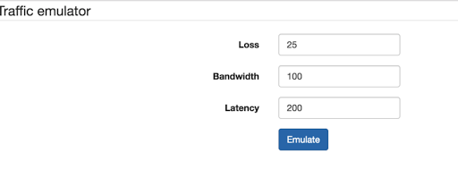

# openwrt-traffic-emulator
OpenWRT traffic emulator with bootstrap frontend

These little scripts will provide a frontend to emulate network condition for mobile app testing. The backend cgi use tc qdisc netem to setup Traffic sharping condition for limit bandwidth, loss and latency.
Inspired by this package: https://github.com/shuhaowu/trafficcop

But the trafficcop package does not work on TP-link MR3020 device and provide no custom input for loss, latency and bandwidth so this script provide more simple method.

###Features:

* Frontend to emulate network condition via web frontend, for mobiles app testing, esp live streaming apps.
 * Latency (delay)
 * Packet loss
 * Bandwidth limitation

After connect wireless, go to `http://<router ip>/cgi-bin/traffic` to control traffic condition
Same as trafficcop, this should work on any device that uses `br-lan` as its LAN interface.

### Working devices: (to be updated)

* TP-link MR3020

### How to setup

* On openwrt shell: install uhttpd, tc and kernel module: kmod-sched-core
* Clone repo and migrate traffic, reset to /www/cgi-bin 

### Todo

* ipkg package
* reimplement per IP qos as trafficcop
* Add more netem features: duplicate, corrupt, reorder 

Refer: https://calomel.org/network_loss_emulation.html
